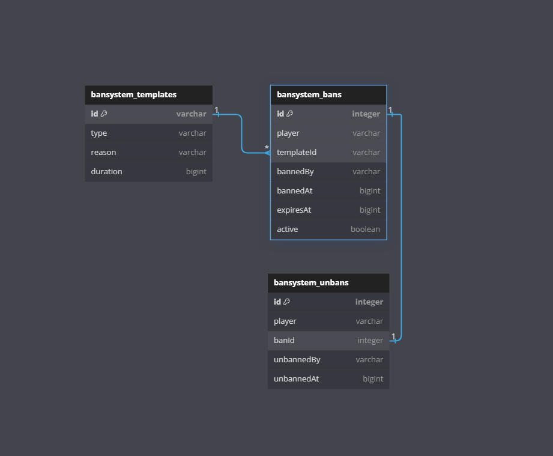

# ban-system #
Das ist ein kleines ban-system, welches als Referenz für GommeHD.net entwickelt wurde.<br>
Dieses ist wie folgt aufgebaut:
<ul>
    <li>API-Module</li>
    <li>Bungee-Plugin</li>
    <li>Microservice</li>
    <li>Webinterface</li>
</ul>

## API-Module ##
Das **api-module** beinhaltet die Entitäten, welche anschließend in der Datenbank persistiert werden.<br>
Dazu zählen:
<ul>
    <li>Ban-Templates</li>
    <li>Ban</li>
    <li>Unban</li>
</ul>

### Entitäten ###
#### Ban-Template ####
Das Ban-Template wird genutzt, um vorgefertigte Ban-Vorlagen mit Standardwerten zu definieren.<br>
Das Datenmodell sieht wie folgt aus:
```java
public class BanTemplate {

    private @NotNull final String id;
    private @NotNull BanType type;
    private @NotNull String reason;
    private long duration;
}

```

#### Ban ####
Ein Ban ist eine Bestrafung eines Users und kann zwei verschiedene Typen haben: `MUTE` und `BAN`. Er enthält alle relevanten Informationen, um die Sperre eindeutig zu identifizieren und ihren Status zu verwalten.
```java
public class Ban {

    private @NotNull final Integer id;
    private @NotNull final UUID player;
    private @NotNull final String templateId;
    private @NotNull final String bannedBy;
    private final long bannedAt;
    private final long expiresAt;
    private boolean active;
}
```

#### Unban ####
Ein Unban ist die Aufhebung einer Strafe durch ein Moderator oder durch Ablauf der Strafe. Es enthält wichtige Daten und dient der Nachverfolgung und Nachvollziehbarkeit.<br>
Das Java-Datenmodell ist immutable, d.h. es kann nicht verändert werden.
```java
public record Unban(@NotNull UUID player, @NotNull Integer banId, @NotNull String unbannedBy, long unbannedAt)
```

### Beziehungen der Entitäten


BanTemplate (1) <--- (N) Ban (1) <--> (1) Unban


## Bungee-Plugin ##
Das **Bungee Plugin** ist das Herzstück des gesamten Systems. Ohne das Plugin können der Microservice und das Webinterface nicht vollständig funktionieren, da es die Brücke zwischen den verschiedenen Systemkomponenten bildet. Es ist für die Kommunikation und Datenübertragung zwischen dem Minecraft-Server, dem Microservice und weiteren externen Systemen verantwortlich. Zusätzlich beinhaltet das Plugin wichtige Funktionen, Befehle und Events.

### Datenbank ###
Das Bungee Plugin verbindet sich mit einer MySQL-Datenbank, um die Daten zu speichern. Für eine effiziente Verwaltung der Verbindungen wird **HikariCP** für das Pooling der Connections genutzt, was eine schnelle und ressourcenschonende Handhabung der Datenbankverbindungen ermöglicht. Dadurch wird die Leistung des Plugins optimiert, indem Verbindungsaufbau und -abbau minimiert werden. Zusätzlich stellen wir sicher, dass alle Daten sicher und zuverlässig gespeichert werden, indem Transaktionen und Fehlerbehandlung korrekt umgesetzt sind.

### Prometheus ###
Wir nutzen **Prometheus** als Monitoring-System, um Metrikdaten in der Monitoring- und Visualisierungssoftware **Grafana** darzustellen. Dadurch können die Daten schnell abgerufen und auf unterschiedliche Weise ausgewertet werden.<br>
Hierzu läuft der Prometheus HTTP-Server in einem separaten Thread, um den Main-Thread nicht zu blockieren. Außerdem werden **Counter** angelegt, um die Anzahl von bestimmten Ereignissen oder Metriken, wie z.B. Bans oder Unbans, fortlaufend zu zählen und in Echtzeit zu überwachen. Dabei werden verschiedene **Labels** gesetzt, um die Zählung nach bestimmten Kriterien, wie z.B. Player UUID, Ban-Template oder Zeitraum, zu filtern und so detaillierte Auswertungen zu ermöglichen.

### RabbitMQ ###
Um mit dem Microservice zu kommunizieren, verbindet sich das Bungee Plugin mit einem **RabbitMQ Message Broker**. So können bestimmte Nachrichten abgefangen und versendet werden. RabbitMQ ermöglicht eine asynchrone Kommunikation zwischen dem Plugin und anderen Systemkomponenten, was die Skalierbarkeit und Performance verbessert. Über Warteschlangen und Exchange-Routings werden Nachrichten effizient verteilt.

## Microservice ##
Der **Microservice** ist eine mit **Spring Boot** geschriebene Applikation, die eine Reihe wichtiger **REST-Schnittstellen** für das Webinterface bereitstellt. Diese Schnittstellen ermöglichen es dem Webinterface, effizient mit dem Microservice zu kommunizieren.

### Datenbank ###
Auch hier nutzen wir **MySQL** im Zusammenspiel mit **HikariCP**, um uns mit der Datenbank verbinden. Die Datenbank im Microservice wird jedoch nur genutzt, um Daten aus der Datenbank zu bekommen, nicht um sie zu modifizieren.

### RabbitMQ ###
Wie bereits im [Bungee-Plugin](#bungee-plugin) erwähnt, wird **RabbitMQ** als Message Broker für die Kommunikation zwischen den beiden Komponenten genutzt. Die Kommunikation erfolgt asynchron.

## Webinterface ##
Das **Webinterface** wurde mit **Nuxt** geschrieben und ist für die Verwaltung von Banns zuständig. Es ist nicht wirklich ausgebaut und wurde nur entwickelt, um sein Können zu zeigen.<br>
Aktuell besteht sie aus einer Seite, auf welcher gebannte Spieler aufgelistet werden. Zu diesen Strafen kann man sich weitere Details anzeigen lassen und die Spieler anschließend per Knopfdruck entbannen.

## Kommunikation
Es kommunizieren mehrere Applikationen miteinander: 
<ul>
    <li>Bungee-Plugin -> Prometheus</li>
    <li>Bungee-Plugin <-> Microservice</li>
    <li>Microservice <-> Webinterface</li>
</ul>

### Bungee-Plugin -> Prometheus ###
Wie bereits oben geschrieben, ist im Bungee-Plugin der **Prometheus HTTP-Server** eingebaut, welcher in einem eigenen Thread läuft. Sobald man einen der angelegten **Counter** inkrementiert, wird die Metrik über den HTTP-Server exportiert.

### Bungee-Plugin <-> Microservice ###
Die Kommunikation zwischen Bungee-Plugin und Microservice erfolgt über **RabbitMQ**.<br>
Wenn ein Spieler **entbannt** werden soll, wird eine Message an das Bungee-Plugin geschickt. Dieses nimmt die Message entgegen, entbannt den Spieler und sendet eine Bestätigung zurück an den Microservice.


### Microservice <-> Webinterface ###
Microservice und Webinterface kommunizieren über **HTTP**. Das Webinterface schickt eine **HTTP-Request** an den Microservice. Der Microservice verarbeitet diese und gibt anschließend eine **HTTP-Response** wieder, welche das Webinterface für weitere Funktionen nutzen kann.
